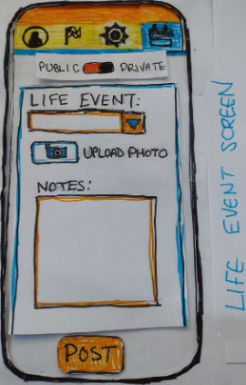
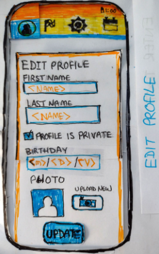
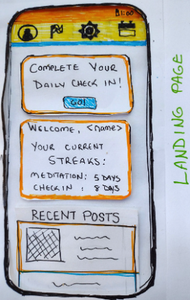
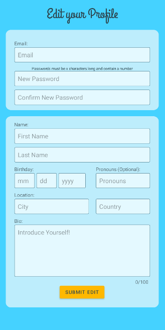
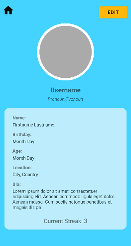
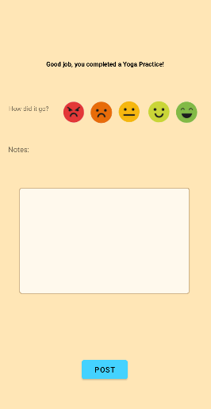
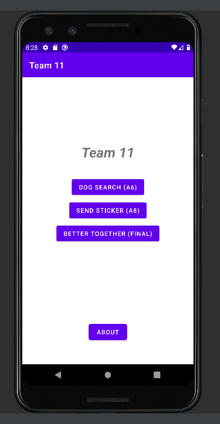
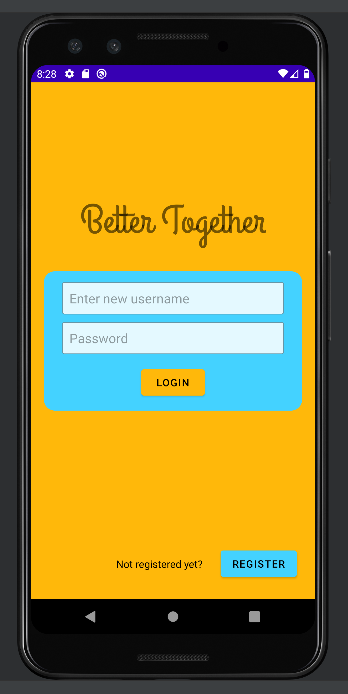
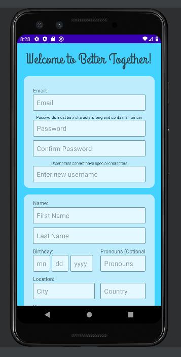
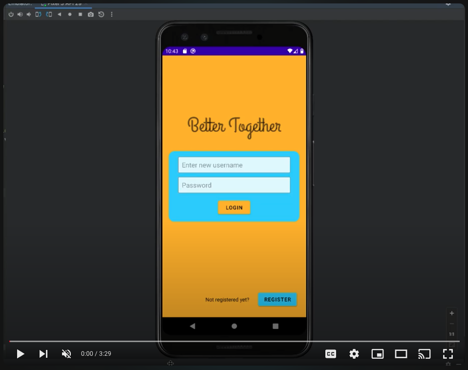

# Better Together: Mental Health Support App

## <i>Team Work Makes Serene Work</i>

### Proposal
The mental health support app project began with a clear objective: to create an application catering to working adults, enabling them to track mood, formulate self-maintenance plans, and connect with supportive peers. The guiding slogan was <i>"Team work makes serene work."</i>
 

<a ref="extra/ProjectProposal.pdf"> Original project proposal </a> 

## 
       
### Planning
 Starting with paper proofs, the team delved into conceptualizing the app's structure and design. These paper mockups not only facilitated initial feedback but also laid the groundwork for understanding user interfaces and design principles. Seeking feedback from a friend led to adjustments based on both reactive and reflexive responses. Tabs were refined, features were merged, and customization options were integrated.

<a ref="extra/ProductDesign.pdf"> More details on design process </a> 
<figure>
    
    
    
    <figcaption> Hand drawn proofs, used to get feedback from users </figcaption>
</figure>

##
### Prototype
The transition from paper to digital occurred in Figma, where realistic mockups for each mobile screen ensured consistency. Features from different versions were incorporated to address feedback concerns, including a redesign of the activity selection screen.
<a ref="https://www.figma.com/file/7iNaPEw8a4HApMGEmjPuDR/Better-Together?type=design&node-id=0-1&mode=design&t=1znsbuIMkPGvTaEu-0">Link to Figma Layout</a>
 
<figure>
    
    <figcaption> Layout Mockups in Figma </figcaption>
</figure>

##
### Production
Coding marked the shift from design to functionality. Responsibilities were divided among team members, with a focus on designing layouts, implementing specific pages, and managing database logic. Collaboration and communication were crucial, with an additional role in project management.
 
<figure>
    
    
    
    <figcaption> Sample XML Layouts in Android Studio </figcaption>
</figure>

### Leadership in Process
Beyond individual contributions, I took on a leadership role. Serving as a reminder for code repository submissions and orchestrating the integration of separate elements into a coherent program, I delved into project management. The experience taught valuable lessons in planning, coordination, and teamwork.

 
<figure>
    
    
     
    <figcaption> App Emulation in Android Studio </figcaption>
</figure>

##
### Conclusion
This project helped me get more comfortable with: Java, OOP, the software development process, especially planning, as well an introducing me to the Android software lifecycle, the Android Studio IDE and emulator, as well as Realtime Firebase 
 
<figure>
    <a href="https://youtu.be/BjANjNxfnYM?si=0DPlBTTkeh_yX5P8">
        
        <figcaption> YouTube Walkthrough of Registration and Profile View/Edit </figcaption>
    </a>
</figure>

##
### What I learned from this project

 
<a ref="extra/OriginalReadMe.pdf"> Original ReadMe for this project </a> 

